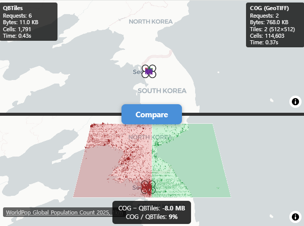

# QBTiles

**QBTiles** (Quadkey Bitmask Tiles) — a spatial data format that encodes existence as a tree structure, reducing ID storage cost to zero.

**[Documentation](https://vuski.github.io/qbtiles/)** | **[Live Demos](https://vuski.github.io/qbtiles/demo/)** | **[한국어 문서](https://vuski.github.io/qbtiles/ko/)**

## Install

```bash
# Python — build & write QBT files
pip install qbtiles

# TypeScript/JavaScript — read & query QBT files in the browser
npm install qbtiles
```

## What It Does

Map tiles and spatial grids are inherently quadtrees. QBTiles encodes **cell existence as 4-bit bitmasks** in BFS order. The position of each entry is implied by the tree structure — **no IDs, no coordinates stored**.

```
Level 1:  [0100]          → only child 1 exists
Level 2:  [0001]          → only child 3 exists
Level 3:  [0010]          → only child 2 exists
```


### Three Modes

| Mode | Flags | Use Case | Access | Comparable to |
|------|-------|----------|--------|---------------|
| **Variable-entry** | `0x0` | Tile archives (MVT, PNG) | Per tile | PMTiles |
| **Fixed row** | `0x1` | Raster grids | Per cell (Range Request) | COG (GeoTIFF) |
| **Fixed columnar** | `0x3` | Compressed grids | Whole file (gzip) | Parquet |

## Benchmarks

### Variable-entry — Tile Index (vs PMTiles)

| Dataset | Entries | PMTiles | QBTiles | Reduction |
|---|---|---|---|---|
| adm-korea | 36K | 80.9 KB | 61.3 KB | **-24.3%** |
| Full OSM | 160M | 300.7 MB | 235.2 MB | **-21.8%** |

### Fixed row — Raster Grid (WorldPop 51M cells, float32)

| Format | Size | Ratio | Per-cell access |
|---|---|---|---|
| FlatGeobuf | 6,001 MB | 29.4x | per feature |
| GeoParquet | 700 MB | 3.4x | full download only |
| GeoTIFF (COG) | 276 MB | 1.4x | 512×512 block |
| **QBTiles** | **204 MB** | **1.0x** | **single cell** |

### Fixed columnar — Compressed Grid (Korea 100m, 931K cells × 3 values)

| Format | Size | Per cell |
|---|---|---|
| Parquet (gzip) | 2.9 MB | coordinate scan |
| **QBTiles columnar** | **1.7 MB** | **O(log N) quadkey search** |

## Quick Start

### Python — Build QBT Files

```python
import qbtiles as qbt

# Mode 1: Tile archive — from a folder of z/x/y tiles (e.g., tiles/5/27/12.mvt)
qbt.build("korea_tiles.qbt", folder="tiles/")

# Mode 2: Columnar — coordinates + multiple value columns
# coords: list of (x, y) in the target CRS
# columns: dict of column_name → value list (same length as coords)
# cell_size: grid cell size in CRS units (meters for EPSG:5179)
# → zoom, origin, extent are auto-calculated from coords and cell_size
qbt.build("population.qbt.gz",
    coords=list(zip(df["x"], df["y"])),         # [(950000, 1950000), ...]
    columns={"total": totals, "male": males, "female": females},
    cell_size=100, crs=5179)                     # 100m grid, Korean CRS

# Mode 3: Fixed row — coordinates + single value array (for Range Request)
# values: flat list of numbers (one per cell)
# entry_size: bytes per cell (4 for float32)
qbt.build("global_pop.qbt",
    coords=list(zip(lons, lats)),                # [(-73.99, 40.75), ...]
    values=population,                           # [52.3, 41.2, ...]
    cell_size=1000, entry_size=4,                # 1km grid, 4 bytes/cell
    fields=[{"type": qbt.TYPE_FLOAT32, "name": "pop"}])

# GeoTIFF → QBTiles conversion (cell_size, CRS, extent auto-detected)
qbt.build("worldpop.qbt", geotiff="worldpop_2025.tif")
```

### TypeScript — Read & Query

```typescript
import { openQBT } from 'qbtiles';

// openQBT reads the header, detects the mode, and loads data automatically.

// Mode 1: Tile archive — serve MVT/PNG tiles from a single .qbt file
const tiles = await openQBT('korea_tiles.qbt');
const tile = await tiles.getTile(7, 109, 49);  // ArrayBuffer (gzip MVT) | null
tiles.addProtocol(maplibregl, 'qbt');           // one-line MapLibre integration

// Mode 3: Fixed row — per-cell Range Request on a remote file
const grid = await openQBT('https://cdn.example.com/global_pop.qbt');
const cells = await grid.query([126, 35, 128, 37]);  // [west, south, east, north]
// → Array<{ position: [lng, lat], value: number }>

// Mode 2: Columnar — downloads entire file, queries in memory
const pop = await openQBT('population.qbt.gz');
pop.columns!.get('total')!;                     // number[931495] — direct access
const result = await pop.query([126, 35, 128, 37]);
// → Array<{ position: [lng, lat], values: {total: 523, male: 261, female: 262} }>
```

## File Format (v1)

```
[Header 128B+]  magic, version, flags, zoom, CRS, origin, extent,
                bitmask_length, values_offset, index_hash (SHA-256), field schema
[Bitmask]       gzip-compressed 4-bit nibbles in BFS order
[Values]        row: raw entry_size × leaf_count (Range-requestable)
                columnar: column-by-column (varint + fixed types)
```

Full spec: [format-spec.md](docs/format-spec.md)

## API Reference

### Python (`pip install qbtiles`) — Writer

| Function | Description |
|----------|-------------|
| `build(output, ...)` | Unified builder — auto-detects mode from `folder` / `columns` / `values` / `geotiff` |
| `read_qbt_header(path_or_bytes)` | Parse QBT header to dict |
| `tile_to_quadkey_int64(z, x, y)` | Tile coords → 64-bit quadkey |

Low-level: `build_quadtree()`, `serialize_bitmask()`, `write_qbt_variable()`, `write_qbt_fixed()`, `write_qbt_columnar()`

### TypeScript/JavaScript (`npm install qbtiles`) — Reader

| Function / Class | Description |
|----------|-------------|
| `openQBT(url)` → `QBT` | Unified loader — auto-detects mode from header flags |
| `QBT.getTile(z, x, y)` | Fetch tile data via Range Request (variable mode) |
| `QBT.query(bbox)` | Spatial query — all modes (Range Request or in-memory) |
| `QBT.columns` | Column values as `Map<string, number[]>` (columnar mode) |
| `QBT.addProtocol(maplibregl)` | One-line MapLibre custom protocol (variable mode) |
| `QBT.toWGS84(x, y)` | CRS conversion via proj4 (built-in for common EPSG codes) |
| `registerCRS(epsg, proj4Def)` | Register custom CRS definitions |

Low-level: `parseQBTHeader()`, `queryBbox()`, `mergeRanges()`, `fetchRanges()`, `readColumnarValues()`

## Live Demos

### [Tile Viewer](https://vuski.github.io/qbtiles/demo/tiles/) — Variable-entry (0x0)
MVT vector tiles served via QBTiles index + Range Request. Administrative boundaries of South Korea.

[](https://vuski.github.io/qbtiles/demo/tiles/)

### [Population Grid](https://vuski.github.io/qbtiles/demo/population/) — Fixed columnar (0x3)
931K cells in 1.75 MB. Korea 100m population grid with 3 values per cell at 1.97 Byte/cell.

[](https://vuski.github.io/qbtiles/demo/population/)

### [Range Request Comparison](https://vuski.github.io/qbtiles/demo/range-request/) — Fixed row (0x1)
Split-screen comparison: QBTiles cell-level vs COG block-level Range Request on WorldPop 1km global population.

[](https://vuski.github.io/qbtiles/demo/range-request/)

### [File Viewer](https://vuski.github.io/qbtiles/demo/viewer/) — All modes
Drag & drop any `.qbt` or `.qbt.gz` file to inspect its contents. Supports all three modes with auto-detection.

## Related Work

- **Sparse Voxel Octree (SVO)** — Same bitmask principle in 3D (8-bit masks for octree)
- **LOUDS** — Succinct tree encoding via BFS bit sequences
- **PMTiles** — Hilbert curve tile indexing with varint delta encoding

## License

MIT
