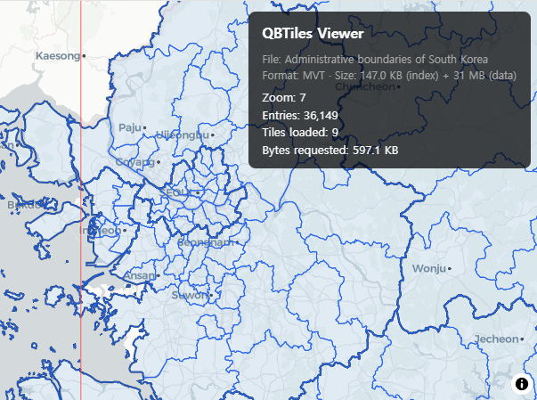
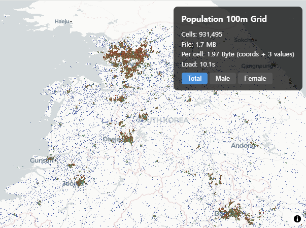
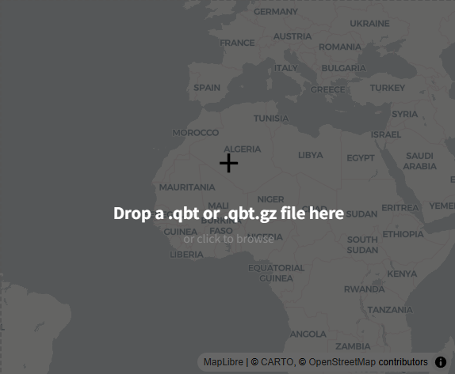

# Example: Web Client

All demos use a single entry point: `openQBT(url)`. It reads the header, detects the mode, and loads data automatically.

```bash
npm install qbtiles
```

```typescript
import { openQBT } from 'qbtiles';
const qbt = await openQBT('file.qbt');
```

- [Demo 1: Tile Archive Viewer](#1-tile-archive-viewer) — MVT tiles via MapLibre
- [Demo 2: Columnar Grid](#2-columnar-grid) — 930K population cells from 1.7 MB
- [Demo 3: Range Request](#3-range-request) — per-cell query on 51M cell dataset
- [Demo 4: File Viewer](#4-file-viewer) — drag & drop any QBT file

Full source code: [demo-src/src/pages/](https://github.com/vuski/qbtiles/tree/main/demo-src/src/pages)

---

## 1. Tile Archive Viewer

Serve MVT vector tiles from a single `.qbt` file. PMTiles replacement.

[](https://vuski.github.io/qbtiles/demo/tiles/)
<a href="https://vuski.github.io/qbtiles/demo/tiles/" target="_blank">Live demo</a> · [Source](https://github.com/vuski/qbtiles/tree/main/demo-src/src/pages/tiles/App.tsx)

```typescript
import { openQBT } from 'qbtiles';

// Load — fetches header, then index via Range Request
const qbt = await openQBT('korea_tiles.qbt');
// qbt.mode → 'variable', qbt.leafCount → 36,149

// Fetch a single tile
const tile = await qbt.getTile(7, 109, 49);
// → ArrayBuffer (gzip-compressed MVT) or null

// Register as MapLibre protocol — one line
qbt.addProtocol(maplibregl, 'qbtiles');
map.addSource('src', {
  type: 'vector',
  tiles: ['qbtiles:///{z}/{x}/{y}'],
  maxzoom: 14,
});
```

For **deck.gl** without MapLibre:

```typescript
import { TileLayer } from '@deck.gl/geo-layers';

new TileLayer({
  getTileData: ({ index, signal }) => qbt.getTile(index.z, index.x, index.y, signal),
});
```

---

## 2. Columnar Grid

Load a `.qbt.gz` file (1.7 MB) containing 930K cells × 3 values. The entire file is downloaded and decompressed at once. CRS conversion (EPSG:5179 → WGS84) is handled internally.

[](https://vuski.github.io/qbtiles/demo/population/)
<a href="https://vuski.github.io/qbtiles/demo/population/" target="_blank">Live demo</a> · [Source](https://github.com/vuski/qbtiles/tree/main/demo-src/src/pages/population/App.tsx)

```typescript
import { openQBT } from 'qbtiles';

// Load — downloads, decompresses, parses header + bitmask + values
const qbt = await openQBT('korea_pop_100m.qbt.gz');
// qbt.mode → 'columnar', qbt.leafCount → 931,495

// Access column values directly
const totals = qbt.columns!.get('total')!;   // number[931495]
const males = qbt.columns!.get('male')!;

// Spatial query (in-memory, no network)
const cells = await qbt.query([126, 35, 128, 37]);
// → Array<{ position: [lng, lat], value }>

// CRS conversion (EPSG:5179 → WGS84, built-in)
const [lng, lat] = qbt.toWGS84(950000, 1950000);
```

Render as deck.gl ColumnLayer:

```typescript
import { ColumnLayer } from '@deck.gl/layers';

// Walk bitmask tree to get (row, col) → convert to WGS84 positions
const tileSize = qbt.header.extentX / (1 << qbt.header.zoom);
const positions = leafCoords.map(([row, col]) => {
  const cx = qbt.header.originX + col * tileSize + tileSize / 2;
  const cy = qbt.header.originY + row * tileSize + tileSize / 2;
  return qbt.toWGS84(cx, cy);
});

new ColumnLayer({
  data: positions.map((pos, i) => ({ position: pos, value: totals[i] })),
  getPosition: d => d.position,
  getElevation: d => d.value * 3,
  getFillColor: d => colorByValue(d.value),
  diskResolution: 4,
  radius: 50,
  extruded: true,
});
```

---

## 3. Range Request

Query a subset of a 51M-cell global dataset by bounding box. Only the bitmask index (8.7 MB) is pre-downloaded; cell values are fetched on demand via HTTP Range Request.

[](https://vuski.github.io/qbtiles/demo/range-request/)
<a href="https://vuski.github.io/qbtiles/demo/range-request/" target="_blank">Live demo</a> · [Source](https://github.com/vuski/qbtiles/tree/main/demo-src/src/pages/range-request)

```typescript
import { openQBT } from 'qbtiles';

// Load — fetches 128B header, then bitmask via Range Request
const qbt = await openQBT('https://cdn.example.com/global_pop.qbt');
// qbt.mode → 'fixed', qbt.leafCount → 51,297,957

// Query by bounding box — fetches only the needed cells
const cells = await qbt.query([126, 35, 128, 37]);
// → Array<{ position: [lng, lat], value }>
// Internally: queryBbox → mergeRanges → fetchRanges (HTTP Range Request)

// Check transfer stats
console.log(qbt.lastStats);
// → { requests: 7, bytes: 23100, cells: 4576, timeMs: 120 }
```

---

## 4. File Viewer

Drag & drop any `.qbt` or `.qbt.gz` file to visualize its contents. Auto-detects mode, CRS, and fields from the header.

[](https://vuski.github.io/qbtiles/demo/viewer/)
<a href="https://vuski.github.io/qbtiles/demo/viewer/" target="_blank">Live demo</a> · [Source](https://github.com/vuski/qbtiles/tree/main/demo-src/src/pages/viewer/App.tsx)

```typescript
import { openQBT } from 'qbtiles';

// Load from Blob URL (drag & drop file → ArrayBuffer → Blob URL)
const blob = new Blob([arrayBuffer]);
const url = URL.createObjectURL(blob);
const qbt = await openQBT(url);

// Works with all modes — variable, fixed, columnar
// Variable: qbt.addProtocol(maplibregl) for tile rendering
// Fixed/Columnar: qbt.query(bbox) for cell visualization
```

---

## Mapping Library Integration

`getTile(z, x, y, signal?)` is compatible with all major mapping libraries:

**MapLibre GL JS**
```typescript
qbt.addProtocol(maplibregl, 'qbt');
map.addSource('src', { type: 'vector', tiles: ['qbt:///{z}/{x}/{y}'] });
```

**deck.gl TileLayer** (standalone)
```typescript
new TileLayer({
  getTileData: ({ index, signal }) => qbt.getTile(index.z, index.x, index.y, signal),
});
```

**Leaflet GridLayer**
```typescript
createTile(coords, done) {
  qbt.getTile(coords.z, coords.x, coords.y)
    .then(buf => { done(null, renderToCanvas(buf)); });
  return document.createElement('canvas');
}
```

**OpenLayers**
```typescript
new VectorTile({ loader: (z, x, y) => qbt.getTile(z, x, y) });
```
