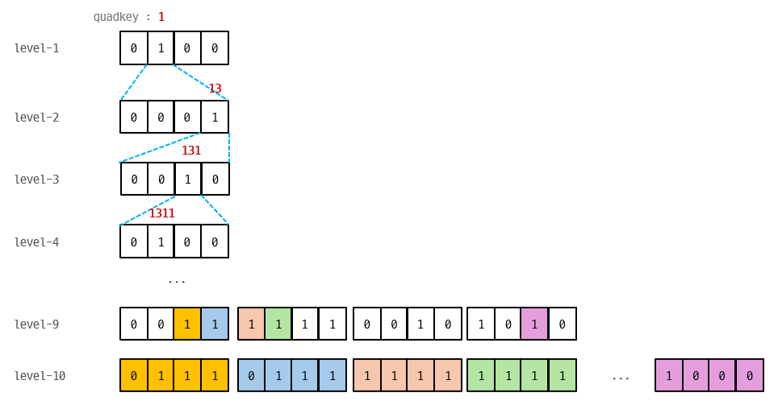

# QBTiles 바이너리 포맷 스펙

## 개요

QBTiles 인덱스 파일은 **gzip 압축된 바이너리**이다. 압축 해제 후 구조:

```
[4바이트 헤더] [비트마스크 섹션] [varint 섹션]
```

## 1. 헤더 (4 bytes)

Big-endian uint32. 비트마스크 섹션의 **바이트 길이**를 나타낸다.

```
offset 0~3: bitmask_byte_length (uint32, big-endian)
```

## 2. 비트마스크 섹션

쿼드트리를 **BFS(너비 우선) 순회**하며, 각 노드의 자식 존재 여부를 4비트 비트마스크로 기록한다.

### 비트마스크 인코딩

```
비트 위치:  [3] [2] [1] [0]
자식 번호:   0   1   2   3
비트 값:     8   4   2   1
```

- 자식 0, 2, 3이 존재하면: `1011` = 8+2+1 = 11
- 4개 자식 모두 존재하면: `1111` = 15

### 바이트 팩킹

4비트 비트마스크 2개를 1바이트에 팩킹한다:

```
byte = (first_bitmask << 4) | second_bitmask
```

비트마스크 총 개수가 홀수면, 마지막 바이트의 하위 4비트는 0으로 패딩.
역직렬화 시 마지막 비트마스크가 0이면 제거한다.

### BFS 순회 순서

```
Level 0 (루트):     [루트의 비트마스크]
Level 1:            [자식0의 비트마스크] [자식1의 비트마스크] ...
Level 2:            [손자들의 비트마스크들...]
...
```

자식이 하나도 없는 레벨(모든 비트마스크가 0)에 도달하면 종료.



위 그림에서 quadkey "1"의 비트마스크가 `0100`이므로 자식 1만 존재하고, 그 자식 "13"의 비트마스크가 `0001`이므로 자식 3만 존재하는 식으로, 비트마스크만 따라가면 모든 quadkey를 복원할 수 있다. level-9, 10에서 타일이 밀집되면 비트마스크의 1이 많아지고, 타일 ID를 개별 저장하는 것보다 효율적이 된다.

### 핵심: 타일 ID를 저장하지 않는다

비트마스크를 BFS 순서로 읽으면서 자식을 확장하면, 각 노드의 quadkey를 **트리 구조에서 복원**할 수 있다. 따라서 타일 ID나 quadkey를 개별적으로 저장할 필요가 없다.

## 3. Varint 섹션 (열 방향 저장)

비트마스크 섹션 이후부터 파일 끝까지. 세 개의 varint 배열이 **열 방향으로** 연속 저장된다:

```
[run_lengths 배열] [lengths 배열] [offsets 배열]
```

각 배열의 원소 수 = 비트마스크 개수 (= BFS 순회한 노드 수)

### run_lengths[]

각 타일의 run_length 값. varint 인코딩.

### lengths[]

각 타일의 데이터 바이트 길이. varint 인코딩.
`length == 0`인 노드는 내부 노드(데이터 없음)를 의미한다.

### offsets[] (delta 인코딩)

각 타일의 데이터 파일 내 바이트 오프셋. PMTiles와 동일한 delta 인코딩:

- 연속 타일 (`offset[i] == offset[i-1] + length[i-1]`): `0`을 기록
- 비연속 타일: `offset[i] + 1`을 기록

## 4. 열 방향 저장의 이유

같은 종류의 값을 연속으로 모아 놓으면:
- delta 값의 변동이 작아져 varint 바이트 수가 줄어든다
- gzip 압축 시 패턴 반복이 많아져 압축률이 극대화된다

행 방향(노드별로 run_length, length, offset을 묶어 저장)보다 열 방향이 최종 gz 파일 크기에서 유리하다.

## 5. 역직렬화 알고리즘

```
1. gzip 압축 해제
2. 헤더에서 bitmask_byte_length 읽기
3. 비트마스크 바이트를 읽고 4비트씩 분리
4. BFS 확장으로 모든 quadkey 복원:
   - 루트 quadkey = "" (또는 정수 3)
   - 각 비트마스크에서 1인 비트 → 해당 자식 quadkey 생성
   - 생성된 자식들을 다음 레벨의 큐에 추가
5. varint 섹션에서 run_lengths[], lengths[], offsets[] 읽기
6. length > 0인 노드만 엔트리로 구성
```

## 6. 데이터 파일 접근

인덱스에서 얻은 offset과 length로 데이터 파일에 HTTP Range Request:

```
Range: bytes={offset}-{offset + length - 1}
```

서버리스 환경(S3, CloudFlare R2 등)에서 별도 타일 서버 없이 정적 파일로 서빙 가능.
